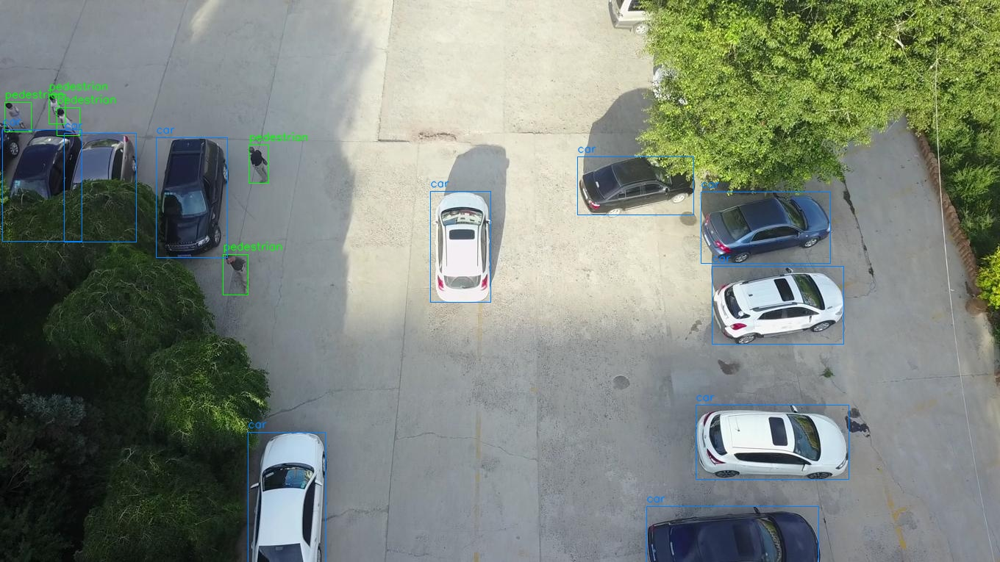
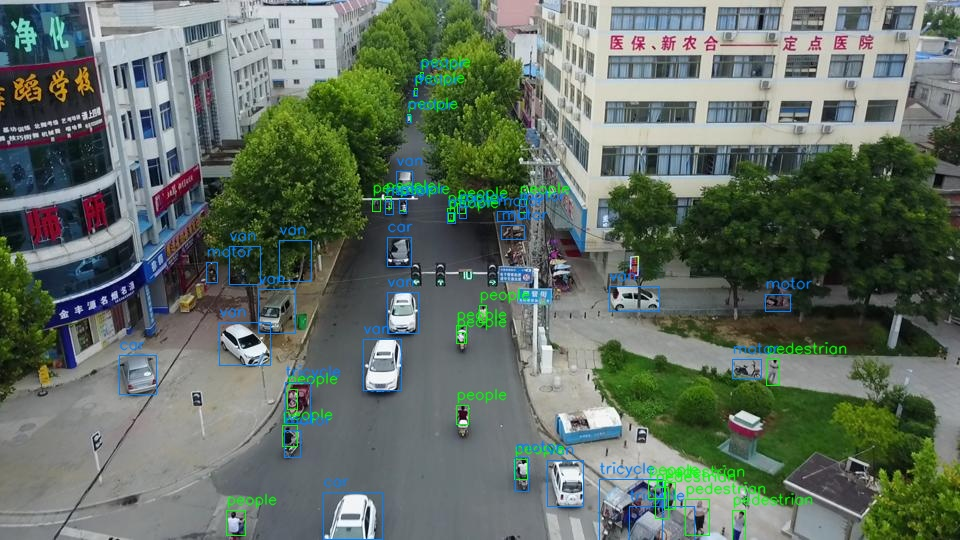
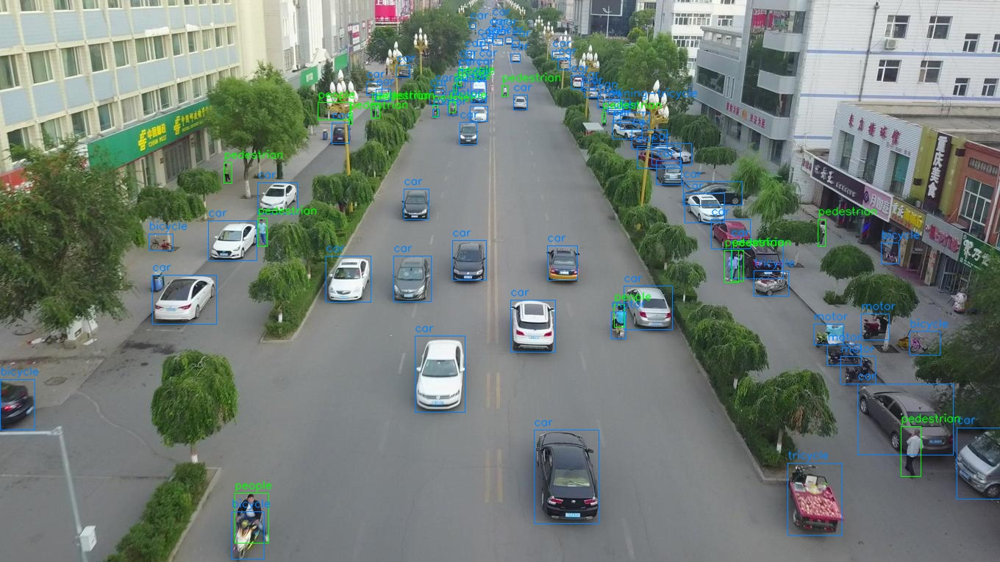
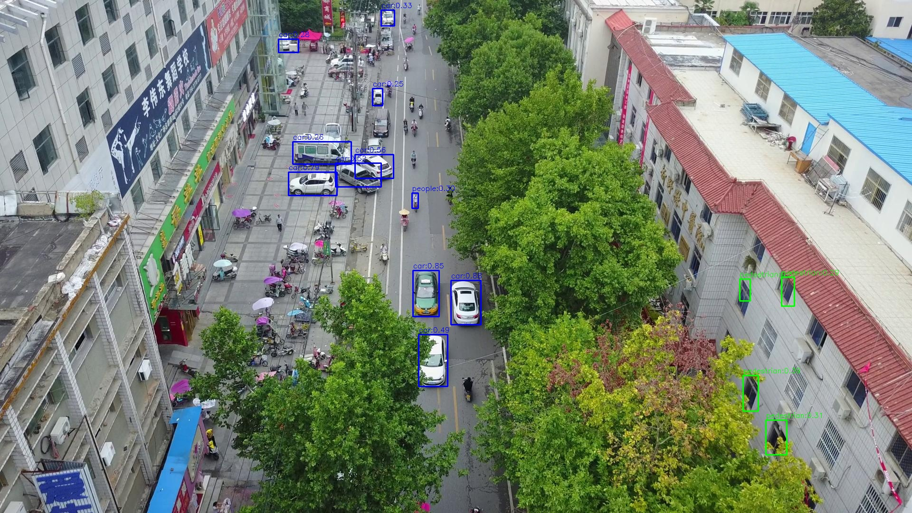
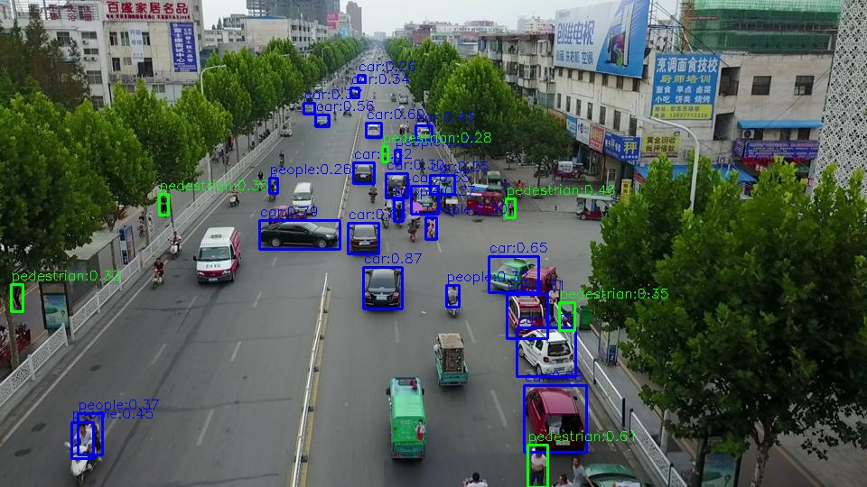
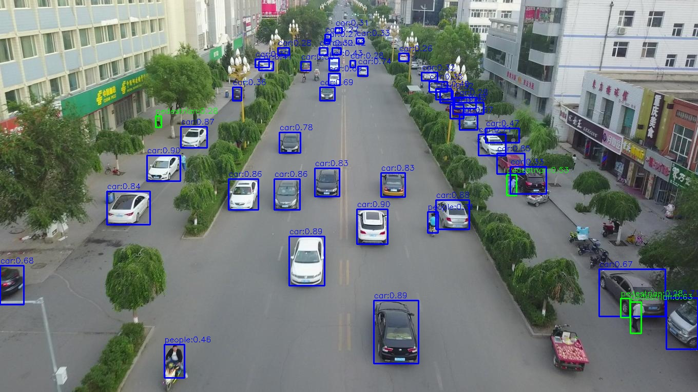

# Drone Human Detection and Counting (VisDrone)

This project implements human and car detection with human counting from drone imagery using the VisDrone dataset and YOLOv8.

## Task 1: Dataset Understanding (Brief)

### 1) Dataset Structure

The dataset is organized under `VisDrone_Dataset/`:

- `VisDrone2019-DET-train/`
	- `images/`
	- `labels/`
- `VisDrone2019-DET-val/`
	- `images/`
	- `labels/`
- `VisDrone2019-DET-test-dev/`
	- `images/` (no GT labels for leaderboard-style testing)
- `visdrone.yaml` (dataset config and class map)

Class mapping (`nc=10`):
`pedestrian, people, bicycle, car, van, truck, tricycle, awning-tricycle, bus, motor`

### 2) Preprocessing and Augmentation Steps

Preprocessing/training pipeline used:

- Input resizing to `imgsz=640`
- Standard YOLO normalization and dataloader preprocessing
- CPU-focused augmentation preset (`cpu-lite`) implemented in `src/augmentation.py`

Current augmentation controls include:

- Geometry: `mosaic`, `translate`, `scale`, `degrees`, `shear`, `perspective`
- Color: `hsv_h`, `hsv_s`, `hsv_v`
- Flips: `fliplr`, `flipud`
- Sampling controls: `mixup`, `copy_paste`, `close_mosaic`

These are exposed in `src/train_yolo.py` via CLI flags (for fast ablations and tuning).

### 3) Challenges Noticed in VisDrone

Key dataset challenges observed during training/evaluation:

- Very small objects at long range (especially humans)
- Heavy crowd density and frequent overlaps/occlusions
- Large scale variation across frames and scenes
- Class imbalance (cars dominate; some classes are relatively rare)
- Ambiguity between `pedestrian` and `people` in dense regions

### 4) Sample Visualization (Ground Truth)

Generated GT overlays from validation split are stored in `outputs/dataset_samples/`.

Examples:







Script used to create these images:

- `src/visualize_dataset_samples.py`

Run command:

```powershell
.venv\Scripts\python.exe src/visualize_dataset_samples.py --root VisDrone_Dataset --split val --num 9 --out outputs/dataset_samples
```

## Task 2: Model Training and Sample Results

### Model Choice

- Framework: YOLOv8 (`ultralytics`)
- Checkpoint used for fine-tuning: `yolov8n.pt`
- Dataset config: `VisDrone_Dataset/visdrone.yaml`

### Training Approach (What Was Done)

1. Started from a smoke run on tiny data to validate the end-to-end pipeline.
2. Trained on full VisDrone train split and validated on VisDrone val split.
3. Continued fine-tuning from the best checkpoint with a longer run and CPU-focused augmentation.
4. Saved `best.pt` and `last.pt` checkpoints for reproducibility.

Training script:

- `src/train_yolo.py`

Example training command used:

```powershell
.venv\Scripts\python.exe src/train_yolo.py --data VisDrone_Dataset/visdrone.yaml --weights runs/detect/train-3/weights/best.pt --epochs 10 --imgsz 640 --batch 16 --device cpu --augment-preset cpu-lite
```

Final run artifacts:

- `runs/detect/train-4/weights/best.pt`
- `runs/detect/train-4/weights/last.pt`
- `runs/detect/train-4/results.csv`
- `runs/detect/train-4/results.png`

### Sample Predictions / Results (Shown)

Prediction visualizations and counts were generated on the VisDrone validation split:

- Prediction folder: `outputs/train4_val_human_car/`
- Per-image counts CSV: `outputs/train4_val_human_car/counts_summary.csv`

Training/validation metric summary from the best run:

- Precision: `0.372`
- Recall: `0.292`
- mAP50: `0.257`
- mAP50-95: `0.142`

Sample prediction images (examples):







## Task 3: Human & Car Detection with Human Counting

### Detection + Counting Pipeline

The implemented inference pipeline does the following for each image/frame:

- Detects humans and cars
- Draws bounding boxes and class confidence labels
- Computes and overlays total per-image human and car counts

Main script:

- `src/infer_and_count.py`

Example command:

```powershell
.venv\Scripts\python.exe src/infer_and_count.py --src VisDrone_Dataset/VisDrone2019-DET-val/images --weights runs/detect/train-4/weights/best.pt --out outputs/train4_val_human_car --max 100
```

Output artifacts:

- Visualized predictions with boxes + count overlays: `outputs/train4_val_human_car/`
- Per-image count table (`image, humans, cars`): `outputs/train4_val_human_car/counts_summary.csv`

Counting logic:

- A detection is counted as human if predicted class belongs to human class tokens (`person`, `pedestrian`, `people`).
- A detection is counted as car if predicted class belongs to car class token (`car`).
- Class tokens can be overridden via `--human-classes` and `--car-classes`.

## Task 4: Optional Object Tracking (Bonus)

Tracking was additionally implemented using YOLO tracking mode with ByteTrack / BoT-SORT.

Main script:

- `src/track_and_count.py`

Example command:

```powershell
.venv\Scripts\python.exe src/track_and_count.py --src VisDrone_Dataset/VisDrone2019-DET-val/images --weights runs/detect/train-4/weights/best.pt --tracker bytetrack --out outputs/tracking_bytetrack --max 200
```

Tracking outputs:

- Frame-level tracked visualizations: `outputs/tracking_bytetrack/`
- Frame summary CSV with running unique-human-track counts: `outputs/tracking_bytetrack/tracking_summary.csv`
- Additional demo run artifacts: `outputs/tracking_bytetrack_demo/`

## Task 5: Evaluation and Visualization

### Prediction Outputs

- Detection outputs with boxes are saved in:
	- `outputs/train4_val_human_car/`
	- `outputs/train4_val_human_car_overlay_check/`

### Counting Visualization

- Each output image includes overlay text for counts:
	- `Humans: <count> | Cars: <count>`
- Per-image counting table:
	- `outputs/train4_val_human_car/counts_summary.csv`

### Processed Images / Results

- Validation/evaluation plots:
	- `runs/detect/val/`
	- `runs/detect/val-2/`
- Training curves and confusion matrices:
	- `runs/detect/train-4/results.png`
	- `runs/detect/train-4/confusion_matrix.png`
	- `runs/detect/train-4/confusion_matrix_normalized.png`

### Optional Metrics (Reported)

From the final best run (`train-4`) on VisDrone validation split:

- Precision: `0.372`
- Recall: `0.292`
- mAP50: `0.257`
- mAP50-95: `0.142`

Measured CPU inference speed (100 validation images, `imgsz=640`):

- FPS: `35.818`

### Brief Discussion

Strengths:

- Good car detection quality relative to other classes.
- End-to-end pipeline is complete: train -> detect -> count -> visualize.
- Outputs are reproducible with saved checkpoints and scripts.

Limitations:

- Human detection in dense/occluded scenes remains challenging.
- Performance is lower for small objects and less frequent classes.
- CPU-only setup limits real-time throughput for heavier models.

Challenges Faced:

- Small object scale from drone altitude.
- Crowd overlap/occlusion and label ambiguity (`pedestrian` vs `people`).
- GPU compatibility issues in this environment; training/inference kept CPU-focused.

## Deliverables Checklist

- [x] Source code in public-repo-ready structure (`src/`, configs, scripts)
- [x] README with methodology, outputs, and metrics
- [x] Generated output artifacts (predictions, counting CSVs, tracking CSVs)
- [ ] Public GitHub repository link (to add at submission time)
- [ ] 3-5 minute demo video (to add at submission time)
